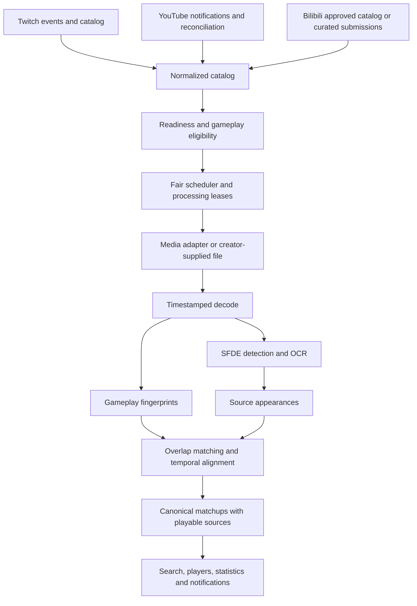

# Spike: BazaarGhost across Twitch, YouTube, and Bilibili

Research date: September 6, 2026, Pacific time; source retrieval continued into September 7 UTC. Status: research and proposed design, not an implemented or benchmarked integration.

Implementation follow-up (September 7): [backend operating guide](multiplatform-backend.md) and [real-video validation](multiplatform-validation.md). This spike retains the original research snapshot; the follow-up documents the implemented subset and experimentally verified playback behavior.

Discovery and stream-completion follow-up (September 7): [automatic platform ingestion](platform-ingestion.md) expands the original treatment into a required platform capability and documents the locally implemented queue, YouTube WebSub, account polling, creator enrollment/discovery, and SFDE dispatch. Bilibili publication polling has experimentally variable access; no universal public stream-ended webhook is assumed. This capability is part of the initial platform scope, not an optional extension after manual video ingestion.

## Recommendation

**Expand BazaarGhost around a platform-independent video catalog and matchup index. Pilot YouTube first, then Bilibili published videos and published livestream replays. Make overlapping footage a first-class relationship: one matchup can have several playable appearances.**

This is feasible as an extension of the existing SFDE pipeline, but it is substantially more than adding two downloaders. The main work is:

1. Establishing a permitted and operationally reliable way to obtain video pixels.
2. Separating creators, platform accounts, published videos, playable parts, and processing jobs.
3. Handling edited footage, historical UI versions, and uncertain recording dates.
4. Grouping repeated footage without merging different encounters with the same opponent.
5. Processing a persistent backlog without starving time-sensitive Twitch work.
6. Updating search, playback, links, statistics, and Discord notifications together.

**The first milestone should prove access and accuracy for a small, explicitly selected corpus.** A successful metadata API call or one successful download is insufficient evidence for unattended backlog processing.

YouTube is the better initial integration because its official metadata, discovery, and player APIs are well documented. Bilibili adds valuable independent footage and historical replays, but creator enumeration, media acquisition, account eligibility, and regional reliability need a separate proof of feasibility. Neither public visibility nor creator consent alone should be treated as blanket platform authorization for automated extraction.

For the initial release, support finite, published recordings. Catalog upcoming/live broadcasts and revisit them after completion. Continuous live recording, DVR handling, and maintaining our own public video archive should be separate projects.

## Evidence and limits of this spike

I inspected both local repositories:

- Backend: `bf06f1e50c7ec375d1906737ea6b40b876fe81b7`.
- Website: `01f5a2f331773ebabcc30fed1b6205371b6bcf0b`.

Platform findings below cite official documentation, platform-hosted announcements, and the source/documentation of the relevant extraction and video-matching projects. Recommendations, effort ranges, thresholds, and cost scenarios are engineering proposals, not measured results.

No platform credentials were used, videos downloaded, SFDE experiments executed, database changes made, or deployments performed. Bilibili returned an HTTP 412 on one video-page retrieval; several official pages exposed useful indexed text but no readable body on direct retrieval. Those are explicitly limited evidence, not playback or API tests. Firecrawl's local connectivity check failed; research used the available web tool.

The repository's referenced `bazaar-db-schema` skill was not present in the searched skill locations. Database observations therefore use checked-in callers and generated frontend types; the proposed schema is conceptual and needs reconciliation with migrations and local Supabase before implementation. This is not a live database audit.

## 1. What is reusable, and where Twitch is embedded today

The code is ahead of parts of AGENTS.md: there are Python and Deno tests, processing leases, deterministic detection IDs, and a timestamp-aware decoder. The current implementation should be the starting point.

| Area | Observed implementation | Multiplatform consequence |
|---|---|---|
| Video identity | The upsert already targets `source,source_id`; frontend generated types contain an internal numeric `vods.id` and string `source_id`. | Reuse internal IDs and the existing platform discriminator. Do not replace these with an unscoped external ID. |
| Creator identity | `update-vods` uses `streamers.id` as a Twitch user ID and maintains EventSub on that record. | A creator needs separate Twitch, YouTube, and Bilibili account records. |
| Discovery | Twitch helpers fetch game chapters; `_shared/supabase.ts` stores Bazaar intervals and has a whole-video fallback when Twitch identifies the game. | Add platform discovery and independent gameplay classification. Chapters cannot be mandatory. |
| Processing preparation | `scripts/vod_workflow.py:get_vod()` requires a numeric external ID and filters `source= twitch`; preparation discovers Twitch renditions. | YouTube IDs and Bilibili BV IDs currently fail before SFDE starts. |
| Pixel acquisition | `SFDEProcessor._resolve_stream()` resolves a Twitch HLS URL through Streamlink. FFmpeg seeks that URL directly. | Replace resolution with an adapter while preserving accurate seeking. |
| Timestamp contract | `video.py` pairs JPEGs with FFmpeg `showinfo` timestamps. SFDE adds the chunk start and currently stores integer seconds. | Preserve that contract; add explicit source timebase and preferably millisecond precision for edited material. |
| Persistence | `get_chunk_details()` drops the platform; `upload_batch()` looks up `source='twitch'`. | Pass the internal video/part IDs through the whole pipeline instead of looking them up from a bare external ID. |
| Screenshot paths | Production paths use external VOD ID and timestamp. | Namespace by internal asset/part and processing revision to avoid collisions and overwrite ambiguity. |
| Template era | Both processing planning and workflow preparation infer old templates from publication date, using August 12, 2025. | A new upload of old gameplay will select the wrong template era. |
| Recognition | English PP-OCRv5 recognition model; `_clean_username()` keeps ASCII letters, numbers, underscore, hyphen, and dot, with a 2–13-character constraint. | Audit actual Bilibili/game-client footage before changing language or validation rules. |
| Scheduling | Dispatch batches are bounded at 256 chunks; workers have a 45-minute timeout. No matrix `max-parallel` is set. | Backlog discovery needs admission control and platform-wide concurrency limits. |
| Availability | Checker only selects Twitch videos currently marked available. | Add platform adapters, richer failure states, and recovery checks for temporarily inaccessible sources. |
| Web app | Player provider, share links, route construction, and some deduplication/filtering use bare Twitch source IDs. | Update identity across routes, caches, result keys, filters, and player state. |
| Discord | Bot constructs Twitch links and computes matchup time as publication date plus frame time. | Use a source appearance URL and avoid inventing gameplay dates for uploads. |

Code references: [catalog upsert](/home/kaio/Dev/bazaar-ghost/supabase/functions/_shared/supabase.ts:104), [streamer update](/home/kaio/Dev/bazaar-ghost/supabase/functions/update-vods/index.ts:41), [workflow preparation](/home/kaio/Dev/bazaar-ghost/scripts/vod_workflow.py:55), [processing planner](/home/kaio/Dev/bazaar-ghost/supabase/functions/_shared/processing.ts:17), [SFDE acquisition](/home/kaio/Dev/bazaar-ghost/sfde/src/sfde.py:525), [frame timestamps](/home/kaio/Dev/bazaar-ghost/sfde/src/video.py:36), [persistence](/home/kaio/Dev/bazaar-ghost/sfde/src/supabase_client.py:60), [username cleanup](/home/kaio/Dev/bazaar-ghost/sfde/src/frame_processor.py:670), [workflow](/home/kaio/Dev/bazaar-ghost/.github/workflows/process-vod.yml:38), [availability](/home/kaio/Dev/bazaar-ghost/supabase/functions/check_vod_availability/index.ts:27), [website player](/home/kaio/Dev/bazaarghost.stream/components/embed/embed-provider.tsx:110), [website search](/home/kaio/Dev/bazaarghost.stream/components/search/hooks/use-vod-search.ts:107), [bot links and dates](/home/kaio/Dev/bazaar-ghost/supabase/functions/ghost-bot/index.ts:54).

## 2. Platform comparison

| Concern | Twitch | YouTube | Bilibili |
|---|---|---|---|
| Initial content scope | Existing VOD ingestion | Published uploads and completed live archives | Public UGC uploads, multipart videos, published live replays |
| Backlog characteristics | Past broadcasts expire; generally 7/14/60 days depending on account | Persistent published catalog, subject to removal and access changes | Published video catalog; unpublished replay storage is a different lifecycle |
| Discovery strategy | Existing streamer/game discovery and EventSub | Known channel uploads playlists, then incremental notifications and reconciliation | Known creator accounts and curated lists; validate authorized enumeration before automation |
| Readiness signal | Existing offline/catalog flow | Broadcast ended plus stable, usable archive | Published playable video/part, rather than room merely becoming offline |
| Acquisition change | Keep existing resolver initially | Separate VOD acquisition adapter | Separate UGC/replay acquisition adapter |
| Playback | Existing Twitch player | Official IFrame API | Official external iframe, with reduced controls until validated |
| Extra complexity | Expiry | Edited compilations, upload/recording date separation | Multipart identity, access restrictions, localized/overlaid footage |

Twitch's published help describes the retention windows; this applies to past broadcasts, not a blanket rule for all Twitch video types. YouTube can automatically archive streams under 12 hours; streams exceeding 12 hours may not be captured at all. Its terms do not guarantee continued hosting. Thus “evergreen” means no ordinary short VOD-expiry assumption, not guaranteed permanence. [Twitch VOD help](https://help.twitch.tv/s/article/video-on-demand?language=sv), [YouTube archive help](https://support.google.com/youtube/answer/6247592?hl=en), [YouTube terms](https://www.youtube.com/static?template=terms).

## 3. YouTube: discovery, backfill, and readiness

### Catalog known channels first

Resolve a creator's channel to its immutable channel ID; store the handle as mutable display metadata. `channels.list` supports channel identifiers and handle lookup. Read the uploads playlist from channel content details rather than manufacturing its ID. Paginate `playlistItems.list`, persist each page, and hydrate the discovered video IDs with `videos.list`. Playlist pages support up to 50 items and pagination tokens. [Channels API](https://developers.google.com/youtube/v3/docs/channels/list), [official uploads example](https://developers.google.com/youtube/v3/guides/implementation/playlists), [playlist items API](https://developers.google.com/youtube/v3/docs/playlistItems/list).

Persist minimal metadata needed for eligibility and playback: title, uploader channel, publication time, duration, status, live timing where present, and applicable restrictions. The video resource exposes duration, live-broadcast information, and embedding/region-related properties; some processing and file details are owner-only. Do not make owner-only fields prerequisites for indexing someone else's public catalog. [Video resource](https://developers.google.com/youtube/v3/docs/videos), [video list API](https://developers.google.com/youtube/v3/docs/videos/list).

Use keyword search to discover candidate creators or videos, not as the exhaustive backfill mechanism. The documented channel-scoped public search configuration is capped at 500 videos. A search result count is therefore not a completeness guarantee. [Search API limitations](https://developers.google.com/youtube/v3/docs/search/list).

A resumed backfill should store both a page cursor and observed IDs. Persist results before advancing the cursor. If a token becomes invalid or ordering changes, restart a bounded scan and rely on idempotent upserts. Reconcile channel playlists and manually supplied IDs for visibility changes and omissions. Treat private, unlisted, deleted, and otherwise inaccessible material as explicit coverage limits.

### New uploads and livestream archives

YouTube's PubSubHubbub notifications cover uploads and title/description changes. They are useful catalog invalidations, but the documented events do not promise a reliable “archive is ready” callback. Use them alongside periodic channel reconciliation and refreshes of known upcoming/live videos. [Push notification guide](https://developers.google.com/youtube/v3/guides/push_notifications).

Proposed readiness flow:

`discovered → scheduled/live → awaiting_archive → ready → processing → indexed`

An ordinary upload can skip the live states. For a broadcast, observe end metadata, then verify that a finite recording with a usable duration is available. Use a bounded retry schedule and classify “still processing” separately from permanent disappearance. A premiere's release time also should not become the assumed gameplay recording time.

The public video resource provides `actualStartTime` and `actualEndTime` when appropriate. These support broadcast lifecycle checks, but they are not sufficient to prove the published archive is untrimmed or that every source-relative second maps directly to wall clock. [Live timing fields](https://developers.google.com/youtube/v3/docs/videos).

### Quota: use the current documentation

The documentation updated September 4, 2026 describes a separate default bucket of 100 `search.list` calls/day and 10,000 units/day shared by other endpoints; list calls for channels, playlist items, and videos cost one unit. This differs from older examples describing search as 100 units per call. Verify the actual project quota in Google Cloud before setting production limits. [Quota calculator](https://developers.google.com/youtube/v3/determine_quota_cost).

Illustrative catalog cost, assuming video hydration in batches of 50:

| Backfill | Approximate list-call units |
|---|---:|
| One channel, 10,000 uploads | 1 channel lookup + 200 playlist pages + 200 hydration calls = **401** |
| 100 channels, 1,000 uploads each | 100 × (1 + 20 + 20) = **4,100** |

These exclude retries, reconciliation, notifications, and other API consumers. Metadata volume is likely manageable for a curated cohort; processing all those video hours is the larger resource question.

## 4. Media access is a launch dependency

### YouTube

YouTube's API developer policies prohibit downloading/caching audiovisual content without prior written YouTube approval, prohibit scraping, constrain use of API data to create derived data, and impose refresh/deletion requirements on stored API data. Many stored metadata classes must be refreshed or deleted within 30 days; there are exceptions and additional consent rules. This needs a specific review of OCR, fingerprints, screenshots, metadata, and the resulting search service. Creator permission does not replace platform approval. [YouTube API developer policies, especially III.E](https://developers.google.com/youtube/terms/developer-policies).

The general terms separately restrict automated access and downloading/reuse except where authorized by the service or permitted through the specified permissions. Using a downloader instead of the Data API does not establish an approved ingestion route. [YouTube terms, Permissions and Restrictions](https://www.youtube.com/static?template=terms).

Evaluate these routes before committing to an unattended downloader:

| Route | What it enables | What must be established |
|---|---|---|
| Creator supplies original recordings or final rendered uploads | OCR and fingerprints on directly supplied media; attach published playback links | Rights for the supplied media and derived index; alignment with the public edit; applicable platform rules for the combined product |
| Platform-approved audiovisual access | Automated ingestion under the approved scope | Written approval/contract and technical access, retention, and derived-data scope |
| Third-party extraction tooling | Technically obtains media in some circumstances | Terms/permission acceptability and sustained operational reliability; not an automatic production recommendation |

**Recommended first feasibility route:** a creator-assisted corpus containing the exact published edit and, where available, its source recording or edit timestamps. It tests the shared architecture and deduplication without making the entire spike depend on platform download reliability. Supplying only an original full stream does not establish where each matchup occurs in an edited upload.

### Acquisition tooling

Streamlink's current documentation labels its YouTube integration as live-only and explicitly excludes VODs; its Bilibili integration handles `live.bilibili.com`, also as live-only. Existing Streamlink support therefore does not cover either requested backlog. [Streamlink plugin capabilities](https://streamlink.github.io/plugins.html).

If a platform extraction route is approved, yt-dlp is a sensible implementation candidate to evaluate, rather than building player extraction from scratch. Its YouTube integration now requires the EJS component and an external JavaScript runtime for full support. Its maintainers also document PO-token requirements, rate limiting, and cookie-related operational problems. These are dependencies to benchmark from the actual worker environment, not promises of reliable access. [yt-dlp EJS](https://github.com/yt-dlp/yt-dlp/wiki/EJS), [extractor notes](https://github.com/yt-dlp/yt-dlp/wiki/Extractors), [PO-token guide](https://github.com/yt-dlp/yt-dlp/wiki/PO-Token-Guide).

Package tested extractor/runtime versions in a reproducible worker image. Run a small canary corpus before updates. Do not depend on developer browser cookies or routinely copy personal sessions into GitHub Actions. Classify login/region/policy restrictions as unsupported or awaiting an approved access method; do not solve them by an uncontrolled retry storm.

## 5. Bilibili: how videos and replays differ

### Published replays can be backlog material

Bilibili's platform-hosted Live Academy announcement from July 2021 explains that the newer replay system converts streams into video submissions, supports automatic publication settings, and allows replay videos to be saved persistently. It also describes a 60-day editing/downloading window and historical size/duration limits. These are historical feature documentation, not verified current universal limits. [Bilibili replay announcement](https://www.bilibili.com/read/cv12120995/).

The indexed text of Bilibili's replay interface says unpublished replays are visible only to the creator and retained for seven days. Direct retrieval of that page returned no readable body. The 2021 announcement mentions a shorter unpublished publication window, so the precise current retention/eligibility rules need confirmation in a participating creator account. Neither number should become hard-coded ingestion logic. [Bilibili replay interface, indexed evidence](https://live.bilibili.com/p/html/live-app-playback/index.html).

**Implication:** index published replay submissions like other finite videos. A live room going offline does not guarantee a public replay exists. An unpublished replay cannot be assumed to be available through public creator catalog discovery.

There is concrete discovery evidence for the desired content classes: an indexed [Bazaar replay dated April 24, 2025](https://www.bilibili.com/video/BV1FfL5zPEbH/) and a [Kripp-labeled Bazaar upload](https://www.bilibili.com/video/BV1K114BiE7t/). These establish useful pilot candidates, not verified playback, ownership, completeness, or an actual duplicate pair. Bilibili titles use “大巴扎”; include that term as well as “The Bazaar” in candidate discovery.

### Identity needs video parts

Distinguish:

- Creator account UID (`mid`) from live room ID.
- Published video BV identifier (`bvid`) and its AV identifier alias (`aid`).
- Playable part/content identifier (`cid`) from the displayed part position (`p`).
- Video collections/series from parts of a single submission.

The official external player supports `bvid`/`aid`, `cid`, and a one-based `p`; when `cid` is supplied, `p` is ignored. It also documents an initial time in seconds and a danmaku toggle. Model part identity explicitly and refresh its displayed position. Do not concatenate multipart durations into one invented public timeline. [Bilibili external player documentation](https://player.bilibili.com/).

### Official integration scope versus web endpoints

The official open-platform catalog advertises account authorization, video management, authorized account/video data, live capabilities, webhooks, and developer identity review. The accessible material does **not** establish an unrestricted public API for enumerating every unrelated creator's uploads or fetching their media. Confirm exact scopes, eligible developer identity, authorization requirements, quotas, and whether pre-existing uploads/replays are exposed. [Bilibili open-platform catalog, indexed evidence](https://openhome.bilibili.com/doc).

Bilibili's indexed developer agreement restricts automated collection of platform-related services/data without written consent. Its full body was not readable through direct retrieval here. Obtain the current agreement and the precise scope applicable to the proposed application before relying on unofficial endpoints. [Developer agreement, indexed evidence](https://open.bilibili.com/agreement/developer-service).

The maintained yt-dlp Bilibili extractor demonstrates technical support for BV/AV videos, parts, DASH and other format data, WBI-signed playback requests, and creator-space enumeration. The source includes login/quality handling and request-failure paths. This proves an existing implementation is available for evaluation, not that these internal web endpoints are a supported external API or reliable at our scale. [yt-dlp Bilibili implementation](https://raw.githubusercontent.com/yt-dlp/yt-dlp/master/yt_dlp/extractor/bilibili.py).

For a pilot, use a handful of identified creators and a curated list of public videos. Add automated creator backfills only after the permitted enumeration route works repeatedly. Keep live-room subscriptions and unpublished-replay access out of the initial dependency chain.

## 6. Proposed architecture

Keep Supabase as the control plane and SFDE as the data plane. Put platform-specific behavior at clear boundaries.

### Control-plane adapters

Each adapter should provide account resolution, paginated catalog enumeration where supported, metadata refresh, readiness classification, and availability checks. Return normalized metadata plus a limited platform-specific payload with an explicit retention policy. Return capabilities such as `supports_catalog_backfill`, `supports_upload_notifications`, `supports_public_replays`, and `supports_embed_seek` rather than spreading platform checks through every caller.

Notifications should enqueue catalog refreshes. They should not directly assert readiness or dispatch expensive jobs from unvalidated callback contents. Make callback handling idempotent, validate subscription challenges, renew leases where relevant, and preserve a reconciliation path if notifications are missed.

### Data-plane adapters

Replace “resolve Twitch URL” with “open this immutable media part and revision.” Return:

- A seekable local file or short-lived media locator.
- Required request headers held only for acquisition.
- Format, dimensions, codec, duration, and rational frame rate.
- Timeline origin and any relationship to the published video timeline.
- Resolver/version identity and typed failures.

Resolve expiring media URLs when the worker runs. Do not store them as durable catalog identifiers or send them to clients. Validate supplied URLs and redirects against the ingestion source policy, and prevent access to private network addresses when accepting user-submitted URLs.

Prefer a supported efficient video rendition for OCR, subject to the established access route. Audio is optional for an independently authorized processing file; keep normal public playback in the platform player. Preserve the adapter boundary if one platform eventually needs a different worker pool or region.

### Chunking and revision contract

Keep 30-minute chunks for long recordings; one short video naturally becomes one shorter chunk. A chunk belongs to a specific part, revision, profile version, and pipeline version. Its work identity should not depend on a mutable title, username, or signed URL.

If an adapter downloads a subsection into a local file, record that file's source offset. Avoid adding the chunk start twice. Use half-open ownership intervals `[start,end)` and optional context outside the boundary for detection/deduplication, with exactly one owner for an appearance.

## 7. Data model: separate a matchup from where it appears

These are proposed entities, not migration DDL. Preserve existing internal VOD IDs during the transition; a table rename is optional and has little immediate product value.

| Entity | Purpose and key fields |
|---|---|
| `creators` | BazaarGhost identity for a person/organization; internal ID, display name, aliases. |
| `platform_accounts` | `creator_id`, platform, external account ID, mutable handle, account role, verification evidence, enablement and discovery settings. Unique `(platform,external_account_id)`. |
| Existing `vods`, generalized as videos | Internal ID, platform/source, external video ID, uploader account, title, publication time, content kind, metadata refresh state. Preserve unique `(source,source_id)`. |
| `video_parts` | Video ID, external part ID, display order, duration. One default part for Twitch/YouTube. Bilibili uses content/part identity. |
| `media_revisions` | Part ID, observed duration and content signature, detection time, processing eligibility. Tracks replacements and edits under the same URL. |
| `processing_runs` / chunks | Revision, pipeline/profile versions, source intervals, state, attempt, lease token, timings and typed error. |
| Raw `detections` | Per-frame OCR evidence with source time, confidence, raw/normalized username, template and profile versions. Preserve provenance. |
| `matchup_appearances` | A source-local occurrence: part/revision, start/end, best frame, recognition confidence, creator perspective, optional canonical matchup ID. |
| `matchups` | Canonical encounter identity, opponent name and confidence, optional recording time/range and provenance. Does not require an available Twitch parent. |
| `overlap_segments` | Two revision intervals, direction/time mapping, confidence, algorithm version, evidence and review status. |
| `notification_deliveries` | Subscriber + canonical matchup + notification kind; durable uniqueness and delivery state. |

A creator can own multiple channels on one platform. An uploader can also be an authorized archive account or an unrelated reuploader; keep uploader attribution separate from the player whose gameplay is visible. Do not infer account ownership from equal handles. Compilations may need creator attribution at the segment/appearance level, not only the video level.

Do not manufacture Twitch IDs for YouTube-only or Bilibili-only creators. Initially populate the new account mapping from current Twitch streamers, keep legacy references for compatibility, then move enablement and platform-specific fields to the appropriate entities.

### Keep four dates distinct

1. `published_at`: when this platform publication became available.
2. `recorded_at` or a recording-time range: when gameplay happened, if supported by evidence.
3. `discovered_at`: when BazaarGhost found the source.
4. `indexed_at`: when processing completed.

A 2026 upload may contain 2025 gameplay. A compilation can contain several recording sessions. Never calculate an upload's matchup date as `published_at + video_timestamp`. Where recording time is unknown, display “recorded date unknown; published …” and use publication/indexing time only with that label.

### Preserve evidence and reversibility

Treat detections as processing observations and canonicalization as a separately versioned decision. Do not destructively delete one platform's rows when a duplicate is found. Keep merge/split history, evidence, and stable redirects for canonical IDs. A processing retry or improved OCR model must not silently change which encounter a historical link identifies.

The current detection UUID includes chunk ID and timestamp; that is useful retry protection, but neither same-source event grouping nor cross-platform deduplication. New extraction runs should stage outputs and publish them atomically so a failed reprocess does not first remove the last good result.

## 8. Overlap and deduplication

### Define the unit correctly

The canonical unit should be **one observed encounter in a creator's gameplay timeline**. These are different cases:

| Case | Desired treatment |
|---|---|
| Several sampled frames of one matchup screen | One appearance, retaining supporting observations. |
| Same stream simultaneously published on two platforms | Two source appearances of the same canonical matchup. |
| An edited highlight containing that encounter | Another appearance, only for the footage retained in the edit. |
| A recap repeats the same moment twice | One matchup, potentially two appearances even within one video. |
| Creator encounters the same username in another run | Separate matchup unless actual duplicate footage is established. |
| Two creators face a similar/same ghost board | Separate observed encounters. |
| A reupload with translated captions | Potential alternate source, with uploader/ownership attribution kept distinct. |

The Bazaar's repeated UI and reusable opponent identities make username equality a particularly weak identity rule. Even a similar opponent board is insufficient without temporal/visual context from the creator's run. False merges can hide legitimate results and create wrong playback links; leave uncertain matches separate.

### Start with source-local grouping

Consolidate adjacent compatible detections into an appearance using continuity, visual similarity, OCR evidence, and scene transitions. A username change alone should not always split an event if OCR fluctuates; a long gap or clearly different scene should not be merged just because the same name reappears. Reconcile chunk boundaries using contextual frames and deterministic ownership.

### Generate overlap candidates cheaply

For an initial cohort, compare sources linked to the same verified creator and use descriptions, supplied source references, recording ranges, and neighboring opponent sequences to prioritize candidates. Publication proximity can help ranking but must not be a hard requirement for historical reuploads.

Store fingerprints before full-frame context is discarded. **The current FFmpeg path crops the frame before Python receives it; current nameplate evidence is too narrow to assume robust video-copy matching.** Add a low-resolution gameplay/board-context fingerprint branch alongside the existing OCR crop. Mask known camera overlays, borders, subtitles, and static UI where appropriate. Keep temporal positions with the fingerprints.

An old Twitch VOD that has expired may have only cropped screenshots left in BazaarGhost. Those can support candidate generation and manual verification, but cannot reconstruct missing board context or a reliable full-stream alignment. Begin retaining permitted fingerprints for new sources before attempting a large historical merge.

### Confirm copied segments, then map appearances

Use perceptual image hashes as a simple baseline, with multiple distinct gameplay states and temporal consistency. Test richer video-copy features only if the baseline misses a valuable share of edits.

Meta's vPDQ supports clip/subsequence similarity using per-frame PDQ hashes. Its reference comparison treats frames as an unordered collection and does not use timestamps to establish alignment. It can help find candidates, but does not itself supply the edit-aware timestamp mapping BazaarGhost needs. [vPDQ design and limitations](https://raw.githubusercontent.com/facebook/ThreatExchange/main/vpdq/README.md).

The VCSL project specifically studies video copy **segment localization**, which is closer to mapping edited highlights back to source recordings. Use its methods as a reference or later evaluation candidate, not as evidence that a generic model will already work on Bazaar footage. [VCSL project and benchmark](https://github.com/alipay/VCSL).

Proposed verification procedure:

1. Retrieve candidate frame matches within a creator's likely source recordings.
2. Require several distinct, high-information visual correspondences, not repeated static nameplates.
3. Fit a local timeline relationship `target_time = a × source_time + b`.
4. Split at cuts, discontinuities, or speed changes; allow separate mappings for reordered segments.
5. Check that each proposed appearance exists visibly in the target segment.
6. Attach only high-confidence appearances to the canonical matchup; queue uncertain ones for review.

Keep `a=1` for the simplest unmodified footage model; permit other slopes only after testing speed-adjusted clips. Three to five distinct anchors over roughly 10–30 seconds is a starting experiment, not a production threshold. Short cuts need stronger evidence or review. A mapping must not extrapolate beyond its verified interval.

### Worked example: Kripp upload with cuts

The following values are illustrative, not an analyzed real video pair:

| Source recording | Published YouTube edit | Mapping |
|---|---|---|
| Twitch 02:00:00–02:12:00 | YouTube 00:00:30–00:12:30 | `yt = twitch − 7,170 seconds` |
| Twitch 02:20:00–02:30:00 | YouTube 00:12:30–00:22:30 | `yt = twitch − 7,650 seconds` |

A matchup at Twitch 02:05:00 maps to YouTube 00:05:30. A matchup at 02:15:00 lies in omitted footage and gets **no YouTube appearance**. A matchup at 02:23:00 maps to 00:15:30. One offset for the whole upload would be wrong.

If Twitch expires, the first and third matchups still have verified playable appearances. The omitted matchup does not acquire a replacement merely because other parts of its original stream were uploaded.

### Avoid unsafe transitive merging

“A resembles B” and “B resembles C” does not establish that every A/C appearance is the same event. Store evidence per appearance and interval, reject contradictory mappings, and make merges reversible. Keep model confidence and OCR confidence separate.

Initially process each eligible source independently and deduplicate the **results**. After overlap accuracy is established, reuse OCR results for verified copied intervals and sample-check target visibility. This later optimization can save OCR work, but does not eliminate all acquisition/decoding needed to discover the overlap. Novel intervals must still be processed.

## 9. Backlog processing as a durable workload

### Separate discovery from compute admission

Catalog pages are cheap relative to video processing. Enumerate eligible historical content with checkpoints, but admit only a bounded amount of video work. A channel enablement toggle must not suddenly launch years of footage.

For each backfill job store account/list scope, date bounds, allowed content kinds, cursor, discovered/admitted/completed counts, eligible duration, cumulative resource usage, pause state, and a clear stopping condition. Date bounds usually refer to publication dates; do not pretend they precisely select gameplay eras.

Use distinct classes:

- **Expiring sources:** Twitch recordings approaching expected expiry.
- **Fresh sources:** new published recordings and archives.
- **Historical backfill:** persistent uploads and published replays.
- **Maintenance:** metadata refreshes, recovery probes, corrected profiles, and reprocessing.

Reserve capacity for fresh/expiring work while guaranteeing backfill some progress. For example, begin with a 70/20/10 fresh-or-expiring/backfill/maintenance allocation and adjust from telemetry. This is a proposed policy, not a measured optimum. Apply fair sharing between creators and per-platform concurrency/rate budgets across all workflow runs; one matrix limit cannot enforce a global platform limit.

### Eligibility is broader than titles

Known game-specific playlists and creator-provided ranges are strong hints. Titles/descriptions in English and Chinese can prioritize candidates; generic gaming categories and absence of “Bazaar” in a title cannot establish absence of gameplay. Tutorials, patch discussions, and reaction uploads may contain little usable matchup footage.

Use inexpensive visual sampling or supplied chapter ranges to identify likely gameplay intervals. For uncertain videos, mark classification uncertainty rather than permanently rejecting them after a few negative samples. Broad discovery and visual sampling must stay within the established access scope.

### Bound retries and preserve completed work

Distinguish rate limits, expired media locators, private/removed content, missing authorization, incomplete archives, unsupported layouts, decode failure, and valid zero-detection results. Retry transient failures with backoff; pause a platform on correlated access failures. Use lease ownership/fencing so a stale worker cannot publish over a newer attempt.

Do not delete raw observations simply because a source becomes unavailable. Whether retained evidence may remain stored depends on its provenance and retention rules, but availability should not cascade-delete unrelated surviving appearances of the same matchup.

### Notifications must understand backfills

Suppress ordinary real-time Discord alerts for historical bulk indexing by default; offer an explicit digest or opt-in historical mode. After canonicalization, a newly attached alternate source should not generate a second “new matchup” alert. Use a delivery outbox and a unique subscriber/matchup/kind key.

Where deduplication is asynchronous, hold notifications briefly for canonicalization or label them as new appearances. A discovery date must not cause old gameplay to be presented as a match that happened today.

## 10. SFDE changes and accuracy risks

### Preserve pixels and source time together

Extend the existing timestamp-aware decoder instead of reverting to frame-index arithmetic. Test late seeks, HLS discontinuities, DASH/progressive input, nonzero starting PTS, variable frame rates, subsection downloads, and multipart playback.

Use source-relative milliseconds internally. A displayed seek can round down and include a short preroll. Keep decode uncertainty and cross-video alignment uncertainty separate. A playable link should land before the encounter with enough context; second-level timestamp arithmetic alone does not prove that.

### Template era follows footage

Replace the publication-date rule with a template/profile decision carrying provenance. Prefer a verified recording date, creator-provided setting, or visual template-family classification. For unknown historical uploads, try supported template families and assess confidence; store an explicit unsupported/ambiguous result if needed.

A compilation can cross UI eras, so per-video overrides may eventually need per-segment refinement. Retain the current date rule only as a Twitch-specific heuristic where its assumptions hold.

### Layout and resolution are independent of platform

Keep a profile precedence such as segment → video/part → platform account → creator → default. A creator's YouTube editor may crop or zoom the image differently from the Twitch stream. Select templates from actual normalized game-region geometry, not a rendition label like “480p”. Preserve aspect ratio, account for letterboxing, and record the normalized coordinate transform.

Start with ordinary landscape gameplay. Vertical/short edits, picture-in-picture reactions, severe crops, and missing matchup screens can remain explicitly unsupported while the catalog retains them for future coverage.

### Sampling and OCR require a corpus

The current 0.5-fps sample rate can miss screens shortened below two seconds by editing. Compare 0.5, 1, and 2 fps and a detector-triggered burst strategy on the same annotated clips. Measure event recall and exact username accuracy, not just frame-level detection counts.

For Bilibili, separate uploader/display-name language from the in-game username alphabet. Do not assume every Bilibili recording uses a Chinese game client or that Bazaar permits Chinese usernames. Inspect native gameplay, translated reuploads, overlays, and real account-name examples. Only expand OCR models and normalization rules when that evidence warrants it. Preserve raw OCR, normalize conservatively, and avoid silently erasing characters into another valid-looking username.

Player-rendered danmaku and subtitles may differ from text burned into the recording. Disabling an embed overlay does not remove baked-in text from media. Include both conditions in the test corpus.

## 11. Search, playback, and availability

### Result semantics

Return a canonical matchup with an ordered list of source appearances. Each appearance includes platform, video/part identity, source timestamp, uploader attribution, availability, embed capability, and alignment confidence. Keep an ungrouped source view available for debugging and uncertain matches.

Rank playable sources by user platform preference, verified timestamp, access/embedding support, useful context, creator/uploader preference, and media quality. A full stream may provide better context; an edited upload may remain available longer. Avoid a fixed “YouTube always wins” rule.

Use a canonical matchup route, for example `/matchups/<id>`, and explicit source routes such as `/watch/youtube/<id>` or `/watch/bilibili/<bvid>/<part>`. Preserve old Twitch links through a compatibility resolver. All filters, cache keys, and result keys must use internal IDs or platform-scoped identities.

Paginate canonical results after grouping. Fetching a page of detections and hiding duplicates in the browser produces short pages, inconsistent counts, and missing results. Distinguish counts of unique matchups, appearances, and source videos in the product and observability.

### Player capability differences

YouTube's IFrame API supports source-time seeking, playback state, and current time. It also documents errors for removed/private content, embedding disabled by the owner, and missing referrer/client identification. These should trigger an appropriate fallback instead of marking every failure as a deleted video. [YouTube player API](https://developers.google.com/youtube/iframe_api_reference).

Bilibili's official external-player documentation establishes initial-time and part selection, but does not establish feature parity with the current Twitch JavaScript integration. Ship a timestamped iframe or external link first. Enable continuous playhead tracking and in-place seek controls only after a supported mechanism is verified. Loading a new iframe at a selected matchup is an acceptable initial fallback. [Bilibili external player](https://player.bilibili.com/).

Test the actual website and mobile behavior for part selection, start time, cookies, embedding restrictions, region restrictions, and app handoff. Do not promise identical controls across all three players.

### Availability has multiple dimensions

Model public visibility, embedding permission, acquisition status, and regional playability separately. A worker's extraction failure does not establish that a viewer cannot watch the page. A healthy metadata response does not establish that the embed will play.

Refresh platform metadata on an explicit schedule, including any required retention deadline. Retry unknown/recoverable availability states, not only currently available videos. On user-visible playback failure, offer another verified source and queue a recheck.

Detect content replacement or trimming through observed duration/content revisions and periodic spot checks. Same external ID does not guarantee an unchanged timeline. Invalidate affected mappings and reprocess only the relevant revision; do not keep presenting stale timestamps as verified.

## 12. Resource model and operations

Measure throughput on representative footage before selecting a worker platform or claiming a monthly price. Relevant inputs are eligible video hours, downloaded bitrate, processing speed, overlap, number of formats tried, retries, screenshot density, and retention.

Let `H` be source-video hours and `R` be end-to-end video hours processed per worker wall-clock hour:

- Worker hours ≈ `H / R`, plus setup, retries, and additional passes.
- Decode sample count ≈ `H × 3,600 × sample_fps`.
- Downloaded GB ≈ `0.45 × H × average_Mbps`, before overhead and retries.
- Monthly cost ≈ worker hours × effective hourly cost + storage + egress + ancillary services.

Illustrative scenarios, **not measured BazaarGhost performance or current provider pricing**:

| Workload | Source hours | Sampled frames at 0.5 fps | Worker hours at 2× / 5× speed | Download at 1–3 Mbps |
|---|---:|---:|---:|---:|
| 1,000 videos averaging 30 minutes | 500 | 900,000 | 250 / 100 | 225–675 GB |
| 10,000 videos averaging 30 minutes | 5,000 | 9,000,000 | 2,500 / 1,000 | 2.25–6.75 TB |

At one 256-bit fingerprint per second, raw hash bytes are about 0.115 MB/video-hour. Ten thousand hours would be about 1.15 GB of hash bytes alone; timestamps, indexes, row overhead, multiple crops, and replicas add substantially. Start with compact per-video fingerprint artifacts and a bounded candidate index; avoid assuming millions of per-frame database rows are free.

Do not assume that reading only sampled frames reduces network traffic proportionally: inter-frame video decoding may still need most of a segment. Also avoid downloading an entire long video once per 30-minute chunk. Benchmark remote seeking versus a permitted shared temporary file and serial chunk processing within one acquisition job.

Keep GitHub Actions for the pilot if it meets access and cost needs. The current workflow can build/load the image per matrix job; a tested immutable prebuilt image would reduce repeated setup for large backfills. Consider dedicated workers only when measured queue delay, setup overhead, access reliability, or throughput justify them. No infrastructure migration is needed to validate the product model.

Track platform, content kind, access route, layout/profile version, template era, OCR model, and pipeline version. Essential metrics include playable hours discovered, accepted hours, catalog lag, backlog age, bytes/video-hour, worker seconds/video-hour, zero-detection rate, exact-name accuracy, duplicate precision, alternate-source coverage, link correctness, and duplicate notifications. Keep high-cardinality IDs in traces/logs rather than unrestricted metric labels. Redact signed URLs and credentials.

## 13. Proposed implementation sequence

Effort ranges below are rough **engineering person-weeks for someone familiar with this codebase**, with normal review/testing included. They exclude waiting for platform permissions or creator participation and are not a delivery commitment. Some work overlaps.

| Phase | Deliverable | Estimate | Exit condition |
|---|---|---:|---|
| 0. Access and corpus | Confirm permitted routes; collect representative supplied/approved media; annotate key events and duplicate pairs | 1–2 | Both platforms have a plausible access path and concrete corpus; unresolved access is a documented gate |
| 1. Shared foundation | Creator/account mapping, source/part/revision contracts, internal IDs throughout, adapter boundary, additive schema compatibility | 1.5–2.5 | Existing Twitch processing/search remain correct; non-Twitch IDs and parts survive end to end |
| 2. YouTube pilot | Known-channel catalog, bounded backfill, readiness checks, permitted acquisition, player and source links | 1–2 | Repeatable ingestion and accurate links on the pilot; budget controls work |
| 3. Matchup grouping | Source-local grouping, canonical appearances, reviewed overlap candidates, source fallback and notification outbox | 1.5–3 | Verified duplicates group correctly; ambiguous cases stay separate; expiry does not hide surviving sources |
| 4. Bilibili pilot | Curated/authorized catalog, multipart acquisition/playback, layout and language validation | 1.5–3 | Native uploads and published replays pass corpus and access checks |
| 5. Hardening and backfill | Revision handling, recovery, controlled scale-up, metadata retention, operations and migration cleanup | 1–2 | Stable cohort operation and predictable backlog cost |

Plan around **roughly 8–15 person-weeks for a dependable initial implementation of both platforms**, conditional on access. A narrow creator-assisted end-to-end demonstration can be much smaller; robust automatic alignment of arbitrary edits may be additional research rather than a fixed-size feature.

Bilibili feasibility should be investigated in phase 0 even if its production implementation follows YouTube. Otherwise a late account/access obstacle could invalidate the chosen architecture or scope.

### Migration and rollback

Use additive migrations created with `supabase migration new`, tested on local Supabase with fixtures. Add new entities/columns, backfill Twitch account/part mappings, expose compatibility views or RPCs, and switch readers gradually behind platform flags. Regenerate frontend types from the tested schema. Validate RLS and public search projections before enabling a platform.

Follow the repository's local → dev → main strategy. User-managed merges and production testing remain the release boundary. This spike creates no migration and runs no scripts.

Rollback should disable a new platform's discovery/admission and revert its UI flag without removing Twitch data or destroying staged source evidence. Leave historical canonical merge operations reversible. Delay removing old columns/routes until compatibility has been demonstrated.

## 14. Experiments and acceptance criteria

The following is the implementation spike backlog. Thresholds are proposed acceptance targets, not results already achieved.

| Experiment | Corpus or procedure | Evidence required to proceed |
|---|---|---|
| Media access | Same approved corpus from local dev and intended worker environment, across multiple days | Resolve/read success, restriction classification, bytes and retries; no dependence on a personal interactive browser session |
| Catalog completeness | Curated channels including one with >500 uploads; known playlists and manual video IDs | All manually verified eligible items accounted for; interrupted/resumed scan does not lose or multiply entries |
| YouTube lifecycle | Ordinary upload, completed stream, upcoming stream, still-processing archive, unavailable source | Only finite ready material admitted; no false deletion from transient readiness failures |
| Bilibili scope | Ordinary UGC, public replay, multipart submission, inaccessible/unpublished control case | Accurate identity/part enumeration; explicit limits for material the account/API cannot access |
| Timestamp correctness | Start/middle/end and late-chunk seeks, variable FPS, HLS/DASH, local subsection, Bilibili part >1 | No offset accumulation or double offset; proposed p95 seek error ≤2 seconds, with the event visibly reachable |
| SFDE accuracy | At least 50 diverse videos initially; manually label all encounters in selected continuous intervals | Proposed ≥95% event recall and ≥98% exact-name accuracy on supported layouts; report separately by platform, language and UI era |
| Edited-screen sampling | Same clips at 0.5/1/2 fps and burst sampling | Recall gain versus worker cost; identify clips with no recoverable matchup screen |
| Deduplication | Real identical streams, cut/reordered highlights, repeated intros, recurring usernames/boards, unrelated negative pairs | Proposed ≥99.5% auto-merge precision on a sufficiently large reviewed set; measure recall separately and preserve uncertain cases |
| Expired Twitch fallback | Controlled source unavailability with verified and omitted highlight intervals | Only matchups actually present in the surviving source remain playable through that source |
| Revision changes | Trim or replace a permitted test video/file and change multipart order | Old mappings invalidated; current links target the correct revision/part |
| Retry/concurrency | Duplicate delivery, overlapping dispatch, worker timeout and lease expiry | No duplicated appearances/notifications and no stale-worker overwrite |
| Backfill isolation | Large queued historical catalog alongside fresh Twitch fixtures | Fresh-work latency stays within an agreed budget; quotas/concurrency/cost cap hold |
| Playback | Desktop/mobile supported browsers, embed-disabled and region-restricted cases | Correct part/start time, useful fallback, honest player capabilities |

For the overlap set, begin with 20–30 real source/edit pairs and many difficult negatives, then expand until precision can be assessed meaningfully. A handful of successful matches cannot validate a 99.5% claim. Split tuning and evaluation by source stream/creator so adjacent frames from one event do not leak across sets.

Record distributions and sample sizes, not just averages. Distinguish “no matchup exists,” “matchup screen was cut out,” “detector missed it,” and “OCR read the wrong username.” These imply different coverage and product decisions.

## 15. Concrete engineering work packages

| Priority | Package | Main code surface | Done when |
|---|---|---|---|
| P0 | Access/corpus decision record | New research fixtures and source-rights records | Approved/supplied corpus and unresolved platform scopes documented |
| P0 | Source identity end to end | Workflow preparation, `_shared/processing.ts`, SFDE client | Internal video/part IDs replace bare external-ID assumptions |
| P0 | Creator/account separation | Streamer discovery/update callers and additive migrations | One creator can have multiple platform accounts without Twitch-ID fabrication |
| P0 | Media adapter and timestamp contract | `sfde.py`, `video.py`, Docker dependencies | Twitch regression and non-Twitch seek fixtures pass |
| P0 | Video/part/revision catalog | New adapters and catalog jobs | Idempotent public/supplied video registration and multipart identity |
| P0 | Source appearances and canonical results | Detection persistence and search RPCs | One encounter can return multiple correctly scoped source links |
| P0 | YouTube creator enrollment, discovery, and readiness | WebSub callback, account polling, durable queue, scheduler | New creators can be added/discovered; unfinished archives retry; cataloged recordings reach SFDE |
| P0 | Bilibili creator enrollment, discovery, and publication polling | Uploader/search adapters, durable queue, scheduler | Published replays and parts are found automatically; blocked feeds remain visible and retryable |
| P1 | Profiles and historical templates | Processing planner, workflow preparation, frame processor | Upload date no longer incorrectly decides footage era |
| P1 | Player abstraction and routes | Website embed provider, search hooks, share routes | Source-specific playback and legacy links work |
| P1 | Availability and revision recovery | Availability checker and catalog refresh | Temporary failure, embedding restriction, removal and edit are distinct |
| P1 | Notification outbox/backfill policy | Ghost bot and notification triggers | No duplicate alternate-source alerts; historical runs respect notification mode |
| P1 | Fingerprints and reviewed overlap | Decode branch, matching worker, review surface | High-confidence copied segments group reversibly |
| P1 | Backfill admission/telemetry | Scheduler and workflow | Platform/global budgets and cost reports are enforced |
| P2 | OCR reuse for copied intervals | Overlap mapping and processing planner | Verified savings with unchanged event recall and timestamp correctness |
| P2 | General edited-video matching | Matching evaluation | Demonstrated value beyond the simpler baseline |
| Later | Continuous live capture | Separate architecture spike | Explicit product requirement, recording rights, storage and DVR lifecycle design |

Existing test surfaces can be extended: [workflow tests](/home/kaio/Dev/bazaar-ghost/scripts/tests/test_vod_workflow.py), [frame contracts](/home/kaio/Dev/bazaar-ghost/sfde/tests/test_frame_contracts.py), [video integration tests](/home/kaio/Dev/bazaar-ghost/sfde/tests/test_video_integration.py), [persistence tests](/home/kaio/Dev/bazaar-ghost/sfde/tests/test_persistence.py), and [processing planner tests](/home/kaio/Dev/bazaar-ghost/supabase/functions/_shared/processing_test.ts).

## 16. Decisions still needed

1. **Acquisition scope:** creator-supplied media, platform-approved extraction, or another explicitly reviewed route? This is the largest launch dependency.
2. **Initial cohort:** which YouTube and Bilibili creators are valuable, and can at least one provide an original-plus-edit pair? Kripp is a useful overlap case, but should not be the only visual layout tested.
3. **Bilibili developer access:** can this project's operator obtain the required account/app scopes, and do they cover historical published replays and multipart uploads?
4. **Reupload policy:** index official creators only initially, or also authorized archive/reupload accounts? How will gameplay attribution and uploader attribution be verified?
5. **Backlog budget:** maximum video hours/day and acceptable spend, plus freshness targets for existing Twitch work.
6. **Historical product behavior:** should search emphasize recently played matches, recently uploaded videos, or all available history? Unknown recording dates must remain explicit.
7. **Evidence retention:** how long may original files, screenshots, hashes, metadata, and derived observations remain stored under each acquisition route?
8. **Deduplication tolerance:** the proposed default prioritizes precision and leaves uncertain duplicates visible. Confirm whether manual review is practical for the initial cohort.

These decisions do not prevent designing the shared foundation. They determine which ingestion routes can be enabled and how far an automated backlog rollout can safely and economically go.

The implementation should be judged by three outcomes: **more distinct encounters searchable, more existing encounters with surviving playable sources, and no loss of trust in who played whom or where a result links.** Source-video counts alone would conceal both duplicate growth and poor historical coverage.
