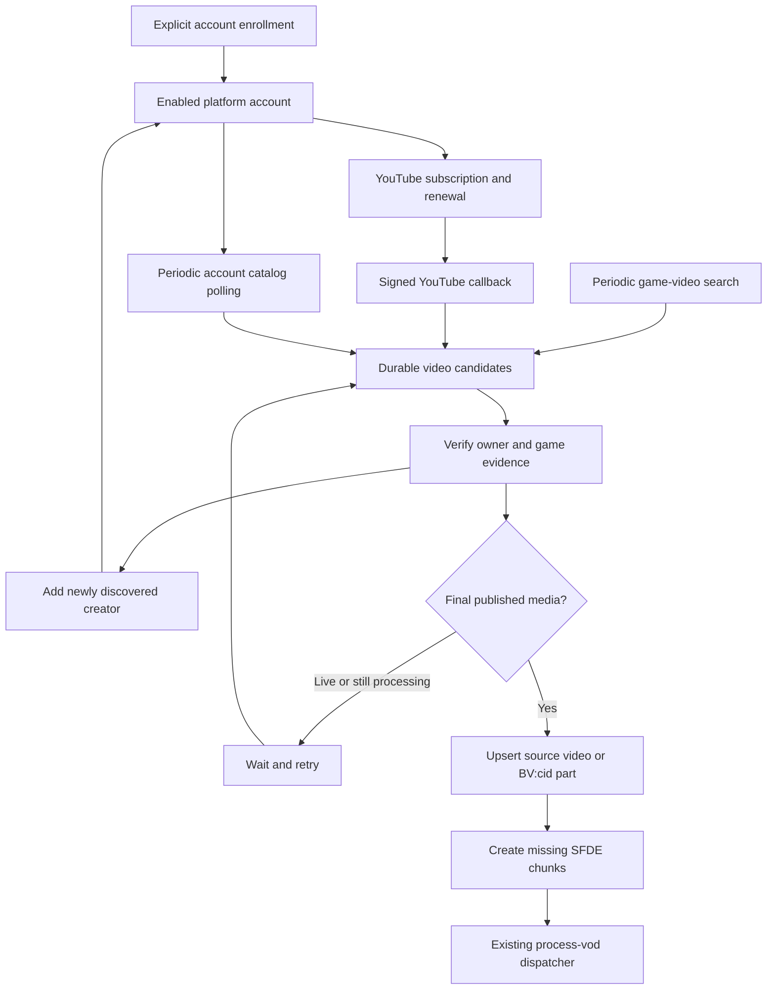

# Automatic creator discovery and ingestion

Updated September 7, 2026. Implemented and tested locally on `codex/multiplatform-backend`. This closes the manual-only ingestion gap in the first multi-platform backend implementation. The hosted callback, real Google hub subscription, and recurring GitHub schedule have **not** been activated or validated in this task.

## What triggers processing

| Platform | Add a creator | Discover creators automatically | Detect new recordings / end of stream |
|---|---|---|---|
| Twitch | Existing streamer catalog | Existing recent Bazaar VOD discovery | Existing `stream.offline` EventSub → VOD catalog → SFDE |
| YouTube | UC channel ID, `@handle`, or channel URL | Bounded recent-video search for The Bazaar; verify full metadata and channel ID | Signed channel WebSub notifications plus recurring `videos` and `streams` polling; retry live/unfinished candidates until final media exists |
| Bilibili | Numeric uploader UID | Bounded recent `大巴扎` video search; verify submission metadata and owner UID | Recurring uploader submission polling and global discovery find **published** replays; ingest their playable `cid` parts |

**A stream ending and a replay becoming ingestible are separate events.** The worker only creates SFDE work for finite published media. It does not record a live stream. A Bilibili stream without a published accessible replay never becomes ingestible through this path.

YouTube documents notifications for uploads and title/description changes. Its published list does not provide a guaranteed stream-ended notification. WebSub therefore accelerates discovery; scheduled reconciliation and durable readiness checks supply the recovery path. [YouTube push notifications](https://developers.google.com/youtube/v3/guides/push_notifications)

I did not establish a generally available Bilibili equivalent to Twitch's public-account `stream.offline` subscription. Its [Live Open Platform](https://open-live.bilibili.com/) is a separate integration surface; this implementation makes no claim to have obtained an approved creator/app integration or a room-to-replay callback contract. A future authorized live integration could wake the same account job when a room ends, but would still need to wait for publication and discover the resulting BV/CID identity.

## Implemented flow



The entry points are [platform_ingestion.py](../scripts/platform_ingestion.py), [platform_discovery.py](../scripts/platform_discovery.py), [youtube-webhook](../supabase/functions/youtube-webhook/index.ts), and [ingest-platforms.yml](../.github/workflows/ingest-platforms.yml).

The migration creates three private, service-only tables. `platform_ingestion_jobs` owns discovery, account scans, and video-readiness jobs. `youtube_websub_subscriptions` keeps callback capabilities, HMAC secrets, request status, and granted leases. `youtube_websub_deliveries` deduplicates received bodies. Public clients cannot inspect subscription secrets, enqueue notifications, or claim jobs.

Accounts retain an independent processing flag and SFDE profile. The catalog's immutable channel/uploader ID is the identity; display names do not connect creators across platforms. An optional existing Twitch `streamer_id` link remains an explicit attribution decision. Discovering a Kripp reupload does not automatically identify its uploader as Kripp.

## Enrollment and creator discovery

With `SUPABASE_URL` and `SUPABASE_SECRET_KEY` supplied for local Supabase or dev:

```sh
python scripts/platform_ingestion.py enroll --source youtube --identity '@Kripparrian'
python scripts/platform_ingestion.py enroll --source bilibili --identity 2663423
```

Enrollment resolves public account identity, enables processing, and automatically creates or wakes the account scan. It accepts optional `--profile-id` and `--streamer-id`. Upload-only YouTube creators are supported: yt-dlp's explicit “no streams tab” response is treated as an absent tab, while access and transport failures remain errors. Archive-only creators are resolved through the streams tab when the videos tab is absent.

The periodic discovery job nominates up to 20 recent search results per platform every six hours. Search results are candidates; the video job fetches full metadata before enrolling its actual creator. Matching new creators are enabled, following the existing Twitch discovery behavior. Existing accounts that an operator disabled remain disabled. Bilibili search markup is removed before title matching.

This is **best-effort discovery, not an exhaustive directory of everyone streaming The Bazaar**. Titles/tags may omit the game, search ranking/indexing can omit videos, and commentary or patch discussions may pass the title gate without containing matchup screens. The current admission rule checks Bazaar title/tag evidence, with SFDE determining whether matchup screens exist. Explicit enrollment and verified gameplay ranges remain useful. Search does not prove that every minute of a mixed-game recording is Bazaar gameplay.

YouTube metadata discovery currently uses maintained yt-dlp extraction, consistent with the backend catalog already implemented; no YouTube API key is required. An official Data API discovery/catalog adapter remains a viable production alternative, described in the original spike. The implemented extractor path must be monitored for upstream changes.

## Polling, catch-up, and historical backlogs

An account scan normally becomes due every 15 minutes. YouTube polls uploads and livestream archives separately. Bilibili polls `space.bilibili.com/<UID>/video` using yt-dlp's maintained uploader extractor, which handles its WBI request construction. These are public web extraction paths, not a contracted Bilibili catalog API. [yt-dlp Bilibili implementation](https://github.com/yt-dlp/yt-dlp/blob/master/yt_dlp/extractor/bilibili.py)

Each tab stores the previous first video ID and the current catch-up position. A scan reads up to 20 entries per tab. If new uploads have pushed the previous head beyond that page, the next job continues farther into the catalog until it reaches that head or the end. Progress advances only after every candidate in the page has been persisted. New uploads during a catch-up are picked up on the following scan. Deletion of the old head can cause a bounded, resumable scan through the older catalog; reordered/pinned lists can still require operator reconciliation.

First enrollment starts with the recent page. It does **not** automatically ingest a creator's entire lifetime of uploads. Historical YouTube backfills retain their separate existing `videos` and `streams` cursors; Bilibili's curated BV/part backfill commands remain available. Those manual commands and their limits are documented in [multiplatform-backend.md](multiplatform-backend.md). Automatic discovery, current-account catch-up, and operator-selected historical backfills have different coverage and cost expectations.

Once a YouTube video is queued, it does not need to remain on the latest channel page to be retried. `is_upcoming`, `is_live`, and `post_live` stay in a durable waiting state. A final recording with positive finite duration can proceed. Extractor/network failures also keep the candidate retryable, with a visible error and backoff; they do not establish that the video was deleted.

Bilibili submission jobs ingest up to 20 parts per lease. Continuation tracks already-seen **CIDs**, so part reordering does not substitute a different playable identity. Recent rediscovery can reopen completed submission jobs after a day to detect appended parts. An old BV that has disappeared from all recent scans needs explicit recataloging to detect later edits or appended parts. This is not a complete historical revision watcher.

## YouTube callback lifecycle

The account poll requests a subscription from Google's documented hub, using the account's channel feed as its topic and the deployed `youtube-webhook` function as its HTTPS callback. Localhost does not register an external subscription. Each account has a random callback capability and a separate random HMAC secret.

The callback verifies a pending request and exact topic before echoing a challenge as plain text with `nosniff`. It records the **granted** lease and renews before expiry. Deliveries require a raw-body SHA-1 or SHA-256 HMAC, bounded XML without DTD/entities, and matching channel/video IDs. The callback commits receipt deduplication and queue insertion atomically before acknowledging. These protocol choices follow [WebSub subscription and delivery rules](https://www.w3.org/TR/websub/).

Our worker requests a ten-day lease, starts renewal within twelve hours of expiry, and waits an hour before retrying an unconfirmed request. Those values are implementation defaults; the hub determines the actual lease. A denial is recorded and does not disable polling. A failed hub request is visible in the subscription row. Disabling the account stops renewal and rejects callbacks; explicit upstream unsubscribe is not implemented, so the outstanding subscription expires at the hub.

The notification path performs no media download, OCR, or GitHub dispatch. Duplicate bodies are retained for 30 days. Replays after that retention window can cause another metadata check, but source identity and existing chunk boundaries still make catalog persistence idempotent. A notification arriving during an active video job sets a follow-up flag so completion cannot discard it.

## Scheduling and the SFDE handoff

```sh
# Bounded local/dev catalog work, without external processing dispatch:
python scripts/platform_ingestion.py run --limit 10 --seconds 300

# Process only already-enrolled accounts/candidates, excluding broad discovery jobs:
python scripts/platform_ingestion.py run --no-discovery --limit 10 --seconds 300

# Hosted dev: also send up to three due videos to process-vod:
python scripts/platform_ingestion.py run --limit 30 --seconds 1200 --dispatch
```

`--no-discovery` excludes discovery jobs from that run; it does not erase candidates queued by earlier discovery. Ingestion jobs use atomic leases with `SKIP LOCKED`, twenty-minute expiry, and completion tokens. Expired jobs can be reclaimed; stale workers cannot finish the new lease. Transient failures back off, and retries retain scan/part progress. Unready video states use a normal fifteen-minute retry. Repeated account-feed failures back off up to four hours; repeated video/discovery exceptions up to roughly five hours.

The scheduled workflow targets **dev**, checks out `dev`, serializes ingestion runs, and wakes at minutes 7, 22, 37, and 52. It processes at most 30 jobs and starts no further job after a twenty-minute budget. An in-flight bounded metadata job can finish after that budget. Job errors are persisted and cause a failed workflow after healthy work has progressed, making partial outages visible.

The handoff queries due pending chunks, including work left by earlier catalog/dispatch failures, and calls the existing authenticated `process-vod` endpoint for at most three source videos. It supplies `expected_environment=dev`; an Edge Function configured for another environment returns 409 before dispatching. Existing atomic chunk claims and dispatch rollback remain in charge. This selection is limited by **video count**, not total source hours; long archives can contain many chunks. Shared fleet concurrency and a daily source-hour budget still need explicit capacity policy before scaling automatic enrollment broadly.

GitHub only activates scheduled workflows present on the repository's default branch; checking out `dev` selects the code and does not change that scheduling requirement. Scheduled runs can be delayed or dropped. Therefore “every 15 minutes” is a configured cadence, not a freshness guarantee. [GitHub schedule behavior](https://docs.github.com/en/actions/reference/workflows-and-actions/events-that-trigger-workflows#schedule)

Activation requires the additive migration and Edge Function on hosted dev, dev secrets/variables including the dispatcher's `ENV=dev` and GitHub token, and the workflow available to the appropriate GitHub trigger. Until the default-branch workflow is in place, manual dispatch can validate the dev code. None of those hosted activation steps were performed here; no production merge or deployment is implied by the local implementation.

## Evidence and remaining checks

The live local exercise on September 7 returned 19 YouTube and 13 Bilibili candidates from bounded public searches. It enrolled existing accounts by YouTube handle and Bilibili UID, polled account catalogs, processed four real video candidates, and added **MabiVsGames** and **_yswc** from verified video metadata. Three new source rows were created and one existing Kripp source was refreshed. Their chunks were cataloged locally; this exercise did not run another SFDE media-processing batch.

Bilibili UID `2663423` successfully yielded an uploader page during the integrated run after earlier HTTP 412/API rejection failures. UID `2561817` remained blocked in that run. Both success and failure paths were observed; the blocked job retained its retry state. This proves feasibility for one feed from this network, **not reliable general uploader coverage**. Global search provides another discovery path but cannot guarantee coverage of everything omitted by a blocked uploader feed.

The HTTP callback was exercised against local Supabase: challenge accepted; repeated completed challenge rejected; unsigned delivery rejected; signed delivery accepted; replay left one receipt and one video job; mismatched owner rejected; disabled account rejected. Tests also cover live → post-live → finalized transitions, lost leases, notification/completion races, catch-up cursor preservation, multipart reordering, and private-table permissions. See [multiplatform-validation.md](multiplatform-validation.md) for final counts.

Before unattended hosted operation is considered validated, run a real Google hub subscription/renewal and an actual live-to-archive cycle; exercise Bilibili feeds from the intended runner over time; measure oldest due job age and per-platform error rates; and verify the catalog-to-SFDE handoff in hosted dev. Those are concrete remaining validation items. Automatic deletion/recovery classification, arbitrary Chinese in-game OCR, automatic copied-footage alignment, and historical revision coverage retain the limitations of the existing backend release.

Operational health lives in job `last_attempt_at`, `next_attempt_at`, `attempts`, `last_error`, and per-tab `state`, plus subscription `confirmed_at`, `lease_expires_at`, and `last_error`. The workflow emits JSON status lines and retains them as an artifact. A Grafana dashboard/alert package for these new fields has not been added. Alerting should focus on overdue work, accounts with repeated failed polls, expired/unconfirmed subscriptions, and zero candidate growth despite active creators.
